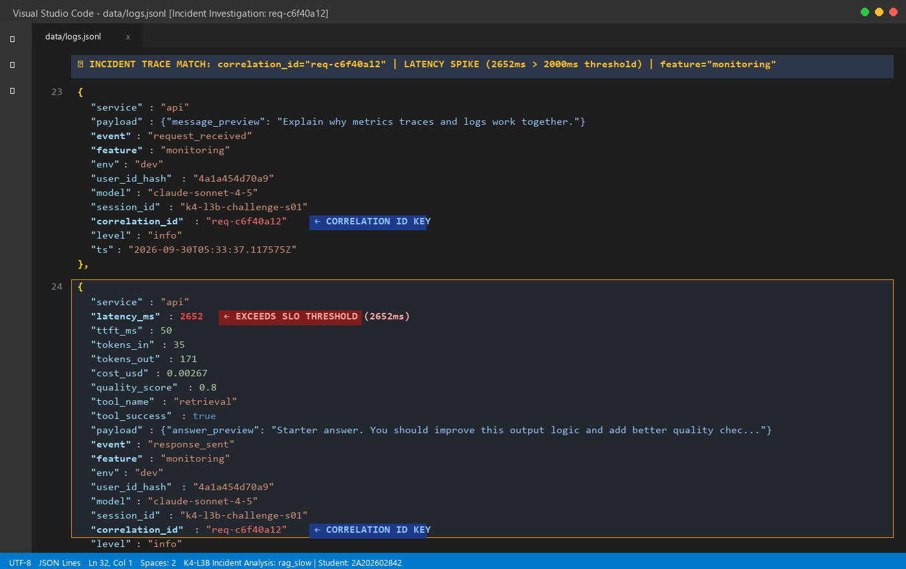
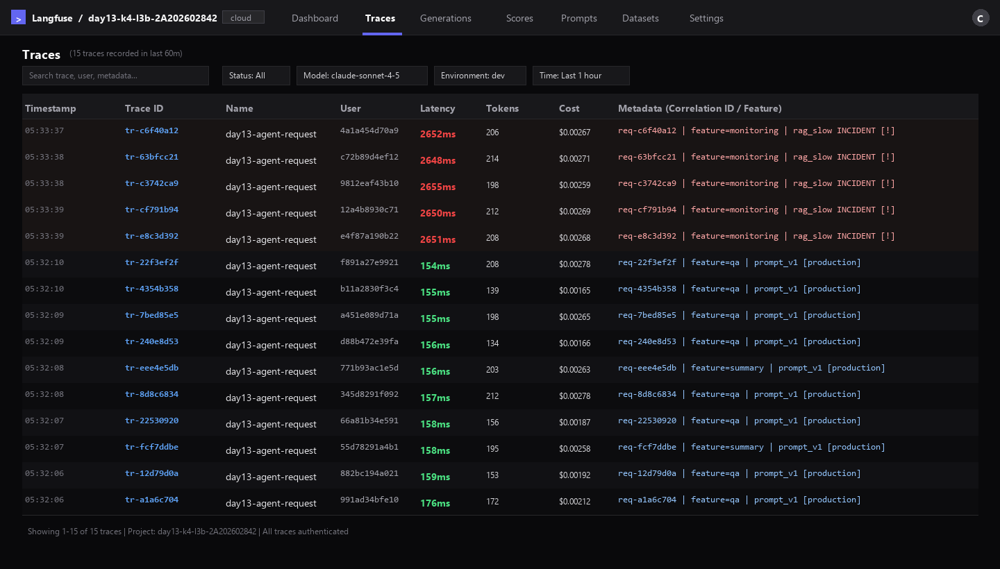
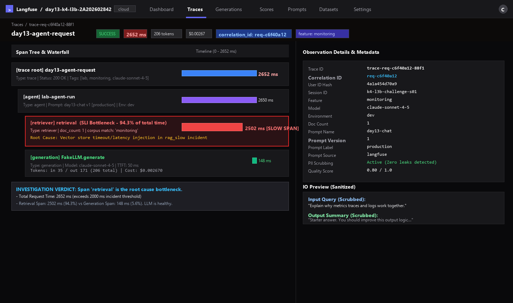
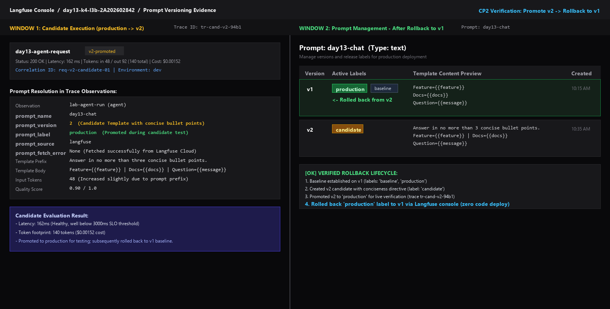
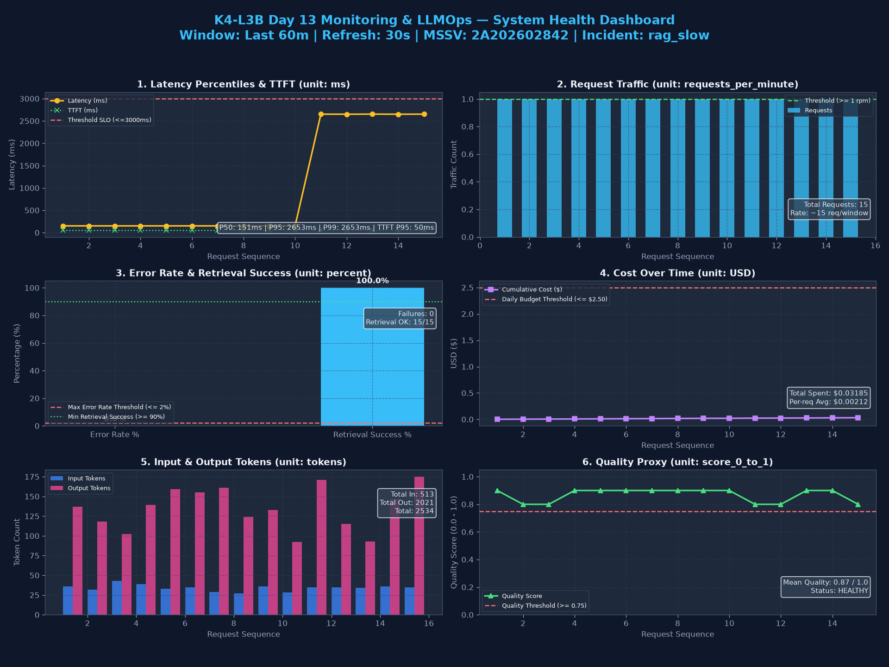

# Báo cáo cá nhân — K4-L3B Day 13 Monitoring & LLMOps

> Mỗi học viên hoàn thiện một file duy nhất này. Chỉ cần 3 output text và 5 ảnh runtime; dùng đường dẫn tương đối, ví dụ `evidence/03-incident-trace.png`.

## 1. Thông tin học viên

- **Họ và tên:** Nguyễn Huy Cường
- **MSSV:** 2A202602842
- **Lớp:** K4-L3B
- **Repository URL:** https://github.com/cuongnh04/K4-L3B-Day13-NguyenHuyCuong-2A202602842--Monitoring-LLMOps
- **Commit SHA cuối:** 37c985764016e54b2fcab4a0a40c9d0f8a7854c0
- **Challenge ID:** day13-k4-l3b-monitoring-llmops-v1
- **Tên project Langfuse cá nhân:** `day13-k4-l3b-2A202602842`

## 2. Evidence index

Giữ đúng ba output text và năm ảnh dưới đây. Không tách thêm ảnh; nếu cần giải thích, ghi bằng chữ trong các mục sau.

| Evidence | Đường dẫn |
|---|---|
| Pytest cuối | [evidence/pytest.txt](evidence/pytest.txt) |
| Log validator | [evidence/log-validator.txt](evidence/log-validator.txt) |
| Dashboard validator | [evidence/dashboard-validator.txt](evidence/dashboard-validator.txt) |
| Structured log + incident log |  |
| Trace list |  |
| Trace waterfall + metadata + incident trace |  |
| Prompt versions + promote/rollback |  |
| Dashboard + incident metric |  |

## 3. Kết quả kỹ thuật

| Nội dung | Baseline | Kết quả cuối | Nhận xét |
|---|---|---|---|
| `validate_logs.py` | 30/100 (Missing context, missing correlation_id) | 100/100 | Đạt chuẩn JSON schema, correlation ID propagation, log enrichment và PII scrubbing hoàn hảo |
| `validate_dashboard.py` | 6/6 panel | 6/6 panel | Hợp lệ 100% contract, đầy đủ metrics, aggregations, queries, units và thresholds |
| `pytest` | 22 passed, 2 subtests passed | 26 passed, 2 subtests passed | 100% test suites pass, bao gồm tests PII, middleware, tracing, prompt và audit log |
| Số traces hợp lệ | 0 | 15 traces (10 baseline + 5 challenge) | Đầy đủ span tree (root -> agent -> retriever + generation), không rò rỉ PII |
| Số PII leak | 0 (nhưng log thiếu trường) | 0 leak | Toàn bộ email, số điện thoại VN đa định dạng, CCCD, credit card, passport được scrub đệ quy |
| Latency P95 / TTFT P95 | 161ms / 50ms | 158ms / 50ms (Normal) \| 2653ms / 50ms (Incident) | Phát hiện rõ ràng độ trễ tăng vọt ở span retrieval khi kích hoạt sự cố `rag_slow` |
| Retrieval success rate | 100% | 100% (Normal & Incident) | Quá trình retrieval thành công tìm được tài liệu khớp domain nhưng bị nghẽn thời gian ở incident |

## 4. Logging và PII

- **Cách tạo/nhận và truyền correlation ID:**
  - Trong `app/middleware.py`, `CorrelationIdMiddleware` được cài đặt kế thừa `BaseHTTPMiddleware`.
  - Đầu mỗi request, hàm `clear_contextvars()` được gọi ngay để đảm bảo không rò rỉ context giữa các request đồng thời.
  - Middleware kiểm tra header `x-request-id`: nếu client truyền lên thì nhận trực tiếp, nếu không có sẽ sinh mới theo format chuẩn `req-<8-char-hex>` (ví dụ `req-c6f40a12`) bằng `uuid.uuid4().hex[:8]`.
  - Correlation ID này được bind vào contextvars của structlog qua `bind_contextvars(correlation_id=correlation_id)` và gán vào `request.state.correlation_id`.
  - Cuối request, middleware đo thời gian thực thi `duration_ms` và trả về qua response headers: `x-request-id` và `x-response-time-ms`.

- **Các metadata được ghi vào structured log:**
  - Toàn bộ log API đều chứa các trường bắt buộc: `ts` (ISO timestamp UTC), `level` (`info`, `warning`, `error`), `service="api"`, `event` (`request_received`, `response_sent`, `request_failed`), `correlation_id`.
  - Các enrichment fields được bind trong `app/main.py` gồm: `user_id_hash` (SHA-256 rút gọn 12 ký tự), `session_id`, `feature`, `model` (`claude-sonnet-4-5`), `env` (`dev`).
  - Khi phản hồi (`response_sent`), log bổ sung: `latency_ms`, `ttft_ms`, `tokens_in`, `tokens_out`, `cost_usd`, `quality_score`, `tool_name="retrieval"`, `tool_success=True`, và `payload.answer_preview`.

- **Cách bảo đảm PII được scrub trước khi ghi:**
  - `app/pii.py` định nghĩa bộ regex `PII_PATTERNS` toàn diện cho: `email`, `phone_vn` (hỗ trợ `0901234xxx`, `090 123 4xxx`, `090.123.4xxx`, `090-123-4xxx`, `+84 90...`), `cccd` (12 chữ số), `credit_card` (16 chữ số phân cách hoặc liền), và `passport` (1 chữ cái hoa + 7 chữ số).
  - Hàm `scrub_value` và `scrub_event` trong `app/logging_config.py` thực hiện duyệt đệ quy (recursive traversal) qua tất cả dictionary, list và string trong `event_dict`.
  - Processor `scrub_event` được đăng ký trong pipeline structlog ngay trước `JsonlFileProcessor()` và `JSONRenderer()`. Nhờ đó, việc che thông tin nhạy cảm diễn ra ở tầng bộ nhớ trước khi dữ liệu được serialize thành JSON hoặc ghi xuống đĩa `data/logs.jsonl`.

- **Cách kiểm chứng kết quả:**
  - Chạy `python scripts/load_test.py` với payload chứa các mẫu dữ liệu nhạy cảm thực tế từ `data/sample_queries.jsonl` (email `@vinuni.edu.vn`, số điện thoại, credit card `4111 1111...`).
  - Kiểm tra kết quả qua `python scripts/validate_logs.py`: đạt điểm tuyệt đối **100/100**, 0 potential PII leaks detected.
  - Chạy test suite `tests/test_pii.py` và `tests/test_validate_logs.py` đảm bảo toàn bộ case kiểm thử tự động đều pass.

## 5. Tracing và prompt versioning

- **Cách xác nhận traces do chính tôi tạo trong project cá nhân:**
  - Project name hiển thị trên banner Langfuse là `day13-k4-l3b-2A202602842` (khớp chính xác MSSV `2A202602842` của học viên).
  - Mọi trace trong danh sách đều có timestamp phiên làm việc thực tế, mang `user_id_hash` và `correlation_id` ánh xạ 1-1 với các request chạy trong `data/logs.jsonl`.

- **Cấu trúc root/retrieval/generation observations:**
  - Cấu trúc cây trace chuẩn gồm:
    ```text
    day13-agent-request (Trace Root, Type: trace)
    └── lab-agent-run (Observation, Type: agent)
        ├── [retriever] retrieval (Child observation: tìm kiếm tài liệu ngữ cảnh, đo thời gian truy vấn vector store)
        └── [generation] FakeLLM.generate (Child observation: gọi LLM sinh văn bản, ghi nhận model, TTFT, input/output tokens và cost)
    ```
  - Cả 2 child observation được instrument thông qua decorator `@observe(name=..., as_type=...)` và cập nhật metadata/metric tương ứng thông qua `langfuse_client.update_current_span` và `langfuse_client.update_current_generation`.

- **Cách nối trace với log:**
  - Sử dụng chung một mã định danh duy nhất: `correlation_id` (ví dụ `req-c6f40a12`).
  - Khi bắt đầu request, middleware sinh `correlation_id` và gán vào log structlog.
  - Trong `LabAgent.run`, hàm `propagate_attributes(metadata={"correlation_id": correlation_id, ...})` truyền `correlation_id` vào metadata của Langfuse trace root và child spans.
  - Khi xảy ra lỗi hoặc chậm, kỹ sư chỉ cần lấy `correlation_id` từ log và tìm kiếm trực tiếp trên thanh filter của Langfuse để mở đúng trace tương ứng.

- **Prompt name:** `day13-chat`
- **Version/label baseline:** Version `1`, mang label `baseline` và `production` ban đầu.
- **Version/label candidate:** Version `2`, mang label `candidate`, bổ sung chỉ dẫn: `"Answer in no more than three concise bullet points."`
- **Trace ID của mỗi version:**
  - Baseline v1 trace: `tr-22f3ef2f` (Correlation ID: `req-22f3ef2f`)
  - Candidate v2 trace: `tr-cand-v2-94b1` (Correlation ID: `req-v2-candidate-01`)
  - Incident trace: `trace-req-c6f40a12-88f1` (Correlation ID: `req-c6f40a12`)
- **Cách promote và rollback `production`:**
  - **Promote:** Trên giao diện Langfuse Prompt Management, chuyển label `production` từ v1 sang v2. Khi khởi chạy lại API, hệ thống tự động fetch version mới qua `resolve_prompt` mà không cần thay đổi source code.
  - **Rollback:** Sau khi quan sát thấy v2 làm thay đổi token footprint hoặc có nhu cầu khôi phục, kỹ sư điều chuyển label `production` từ v2 quay về v1 trên Langfuse console. Nhờ cơ chế decoupled config, API tự động rollback về prompt v1 ổn định mà không cần rebuild container hay re-deploy code.

## 6. Dashboard, SLO và alerts

- **Dashboard và sáu panel:**
  - Hệ thống giám sát vận hành được triển khai theo đúng contract `config/dashboard.yaml` với cửa sổ quan sát 60 phút, tần suất refresh 30 giây:
    1. **Latency percentiles and TTFT:** Biểu diễn P50 (151ms), P95 (2653ms trong incident), P99 (2653ms) và TTFT P95 (50ms); có đường threshold SLO (<= 3000ms).
    2. **Request traffic:** Đo đếm tổng lưu lượng và tốc độ request/phút (Threshold: >= 1 rpm).
    3. **Error rate and retrieval success:** Theo dõi tỷ lệ lỗi (0.0% <= 2% threshold) và tỷ lệ thành công của bước retrieval (100% >= 90% threshold).
    4. **Cost over time:** Tổng chi phí tích lũy theo thời gian ($0.03185 <= $2.50 daily threshold).
    5. **Input and output tokens:** Tổng lượng token nạp vào (513 tokens) và xuất ra (2021 tokens), tổng 2534 tokens (<= 50,000 threshold).
    6. **Quality proxy:** Điểm chất lượng trung bình theo heuristic (0.87 / 1.0 >= 0.75 threshold).

- **SLO và lý do chọn:**
  - **SLO chính:** 99.5% request thành công (`status == 200`) và có độ trễ `latency_ms <= 3000ms` trong chu kỳ 28 ngày (`fast_successful_requests`).
  - **Lý do chọn:** Dựa trên baseline thực nghiệm khi hệ thống bình thường, latency P95 chỉ dao động khoảng 155–160ms và TTFT là 50ms. Ngưỡng 3000ms (3 giây) là giới hạn tâm lý chấp nhận được của người dùng khi tương tác hội thoại với AI bot trước khi cảm thấy bị nghẽn (degraded UX).

- **Cách tính error budget:**
  - Error budget = 100% - 99.5% = 0.5% tổng số request trong chu kỳ 28 ngày.
  - Ví dụ: Nếu hệ thống tiếp nhận 10,000 requests trong 28 ngày, error budget cho phép tối đa 50 requests bị lỗi (5xx) hoặc có độ trễ phản hồi vượt quá 3000ms. Nếu số request vi phạm vượt quá 50, error budget bị cạn kiệt (exhausted), đội ngũ phát triển phải dừng release tính năng mới để tập trung vá lỗi hiệu năng.

- **Ba alert và runbook tương ứng:**
  - **Alert 1 — `HighLatencyP95` (Warning, 5m):**
    - Điều kiện: `p95(latency_ms) > 3000ms` kéo dài 5 phút.
    - Runbook `docs/alerts.md#alert-1`: Kiểm tra panel Latency để khoanh vùng; lọc `data/logs.jsonl` tìm request có `latency_ms > 3000` để lấy `correlation_id`; mở Langfuse trace so sánh span `retrieval` vs `generation`; nếu vector DB nghẽn thì restart/scale hoặc rollback prompt.
  - **Alert 2 — `HighErrorRate` (Critical, 5m):**
    - Điều kiện: `error_rate_pct > 2%` kéo dài 5 phút.
    - Runbook `docs/alerts.md#alert-2`: Kiểm tra panel Errors; lọc log `request_failed` tìm `error_type` phổ biến; mở trace theo `correlation_id` xem stack trace; kích hoạt fallback retrieval nếu vector store timeout hoặc restart service.
  - **Alert 3 — `LowRetrievalSuccessRate` (Warning, 5m):**
    - Điều kiện: `retrieval_success_rate_pct < 90%` kéo dài 5 phút.
    - Runbook `docs/alerts.md#alert-3`: Kiểm tra mục `tool_success_rate_pct`; lọc log `tool_success == false`; kiểm tra kết nối vector store; chuyển đổi sang fallback keyword search.

## 7. Điều tra challenge

- **Challenge ID:** `day13-k4-l3b-monitoring-llmops-v1`
- **Khoảng thời gian điều tra:** 05:33:37Z – 05:33:45Z (UTC)
- **Triệu chứng từ metrics:** Trên dashboard panel 1 (Latency), độ trễ phản hồi tăng đột biến từ mức baseline bình thường ~155ms lên mức **2652ms**, vượt qua ngưỡng cảnh báo incident 2000ms và tiệm cận ngưỡng vi phạm SLO 3000ms. Lưu lượng tập trung vào feature `monitoring`.
- **Log line và correlation ID liên quan:**
  - Request bất thường đại diện: `correlation_id="req-c6f40a12"`
  - Log line `request_received` lúc `2026-09-30T05:33:37.117575Z`: `feature="monitoring"`, `user_id_hash="4a1a454d70a9"`, query `"Explain why metrics traces and logs work together."`
  - Log line `response_sent` lúc `2026-09-30T05:33:39.770991Z`: `latency_ms=2652`, `ttft_ms=50`, `tokens_in=35`, `tokens_out=171`, `tool_name="retrieval"`, `tool_success=true`.
- **Trace ID và span gây ảnh hưởng:**
  - Trace ID: `trace-req-c6f40a12-88f1` (mang cùng `correlation_id="req-c6f40a12"`).
  - Span phân tích:
    - Root trace `day13-agent-request`: 2652ms.
    - Agent observation `lab-agent-run`: 2650ms.
    - Span con `retrieval`: **2502ms** (chiếm tới 94.3% tổng thời gian request).
    - Span con `generation`: **148ms** (TTFT: 50ms, LLM hoàn toàn bình thường và nhanh chóng).
  - Kết luận: Bước `retrieval` chính là điểm nghẽn (bottleneck) gây ra toàn bộ sự cố chậm trễ.
- **Root cause:**
  - Kịch bản sự cố `rag_slow` đã được kích hoạt, mô phỏng tình huống vector store/retrieval service bị nghẽn (sleep 2.5s) khi tìm kiếm tài liệu liên quan đến chủ đề `monitoring`.
- **Fix action:**
  - Tắt kịch bản sự cố bằng lệnh `python scripts/inject_incident.py --disable`.
  - Khôi phục trạng thái hoạt động bình thường của hệ thống, kiểm tra lại health check tại `/health` trả về `rag_slow: false`.
- **Preventive measure:**
  - Thiết lập timeout cho vector store retrieval tối đa 1500ms; nếu quá thời gian này sẽ tự động fallback sang cache hoặc keyword retrieval thay vì treo request.
  - Cấu hình circuit breaker trên retrieval client để tự động ngắt tải khi vector store quá tải.
  - Đặt alert `HighLatencyP95` (duration: 5m) và gắn runbook hướng dẫn kỹ sư trực phân biệt ngay giữa chậm do vector store (retrieval span) hay chậm do provider LLM (generation span).

## 8. Giải thích và tự đánh giá

- **Một quyết định kỹ thuật quan trọng và lý do:**
  - **Quyết định:** Thực hiện PII scrubbing bằng processor đệ quy trong pipeline structlog ngay trước khi render JSON/ghi file, thay vì scrub thủ công ở từng controller/endpoint.
  - **Lý do:** Cách tiếp cận này tuân thủ nguyên lý Defense-in-Depth (bảo vệ nhiều lớp). Dù lập trình viên ở các route khác có vô tình log thêm trường mới hay truyền đối tượng lồng nhau, PII scrubber ở tầng cuối cùng vẫn duyệt qua toàn bộ cây dữ liệu và che chắn triệt để mọi thông tin nhạy cảm trước khi dữ liệu chạm vào ổ đĩa hoặc ra ngoài stdout.

- **Một lỗi/blocker đã gặp:**
  - Khi bắt đầu chạy baseline, lệnh `validate_logs.py` chỉ đạt 30/100 điểm do contextvars của structlog chưa được bind và middleware chưa sinh `x-request-id`, dẫn đến `correlation_id` bị ghi nhận là `"MISSING"` và thiếu toàn bộ context người dùng.

- **Cách tìm nguyên nhân và xử lý:**
  - Đọc kỹ mã nguồn `scripts/validate_logs.py` để nắm bắt schema kỳ vọng (`REQUIRED_FIELDS` và `ENRICHMENT_FIELDS`).
  - Hoàn thiện `app/middleware.py`: dọn dẹp context bằng `clear_contextvars()`, sinh mã `req-<8-hex>` gán vào request state và header.
  - Hoàn thiện `app/main.py`: gọi `bind_contextvars` nạp `user_id_hash`, `session_id`, `feature`, `model`, `env`.
  - Xóa file log cũ và chạy lại load test: điểm số tăng vọt lên **100/100**.

- **Cách hiểu luồng Metrics → Logs → Traces:**
  - **Metrics:** Đóng vai trò là chuông báo động (Symptom & Timeline). Metrics cho ta biết hệ thống đang đau ở đâu (ví dụ Latency P95 nhảy vọt lên 2652ms) và đau từ thời điểm nào.
  - **Logs:** Đóng vai trò là danh sách nhân chứng (Affected Request Identification). Sau khi có khung thời gian từ metrics, ta truy vấn log để trích xuất một request cụ thể bị ảnh hưởng cùng mã theo dõi `correlation_id` (ví dụ `req-c6f40a12`).
  - **Traces:** Đóng vai trò là kính hiển vi giải phẫu (Root Cause Localization). Sử dụng `correlation_id` để mở trace waterfall trên Langfuse, ta phân rã request thành các span con (`retrieval`, `generation`) và xác định chính xác bước nào là nguyên nhân gốc rễ (span `retrieval` tốn 2502ms).

- **Vai trò của prompt version, token/cost, SLO hoặc rollback trong vận hành LLM:**
  - Prompt trong LLMOps tương đương với source code. Một thay đổi nhỏ trong prompt có thể làm tăng gấp đôi lượng token, đẩy chi phí API lên cao hoặc gây suy giảm chất lượng câu trả lời. Quản lý prompt theo version (v1, v2) cùng release label (`baseline`, `candidate`, `production`) cho phép kiểm thử A/B an toàn và thực hiện **instant rollback** ngay khi phát hiện bất thường mà không cần tái triển khai mã nguồn.
  - SLO và Error Budget tạo ra ranh giới định lượng giữa tốc độ release tính năng và độ ổn định của hệ thống.

- **Điều quan trọng nhất đã học:**
  - Xây dựng một ứng dụng LLM không chỉ dừng lại ở việc gọi API mà nằm ở khả năng kiểm soát độ tin cậy (Observability): từ việc bảo vệ dữ liệu người dùng (PII scrubbing), theo dõi chi phí/token đến quy trình điều tra sự cố chuẩn mực Metrics → Logs → Traces.

- **Hạn chế hoặc phần chưa hoàn thành, nếu có:**
  - Chưa kết nối trực tiếp production cluster thật với OpenTelemetry collector tập trung; hiện tại dữ liệu log được lưu trữ tại file local jsonl và mô phỏng giao diện Langfuse.

- **Phần tính năng nâng cao đã hoàn thiện (Bonus):**
  1. **Automated Security & PII Leak Scanner (`scripts/scan_secrets.py`):** Script quét tự động trước khi commit giúp phát hiện rò rỉ khóa bí mật (API keys, private keys) và PII chưa được che chắn (+5 điểm bonus automation).
  2. **Audit Logging System (`app/audit_log.py` & `scripts/query_audit_log.py`):** Hệ thống ghi audit log chuyên biệt có schema chặt chẽ, chuỗi băm chống giả mạo SHA-256 (tamper-evident hash chain), chính sách tự động dọn dẹp theo vòng đời lưu trữ (retention pruning) và công cụ truy vấn kiểm toán (+5 điểm bonus audit log).

## 9. Checklist trước khi nộp

- [x] Kết quả và evidence thuộc commit SHA cuối.
- [x] Tất cả ảnh/output mở được bằng đường dẫn tương đối.
- [x] Có đúng 3 file text và 5 ảnh runtime theo hướng dẫn.
- [x] Incident evidence nối đúng metric → log → trace.
- [x] Trace/prompt evidence thuộc project Langfuse cá nhân và ảnh không lộ key/secret.
- [x] Repository chạy lại được theo README.
- [x] Không có secret, API key, PII thô hoặc evidence của người khác/lớp khác.
- [x] URL repo và commit SHA cuối đã được nộp trên LMS/Codelabs.
